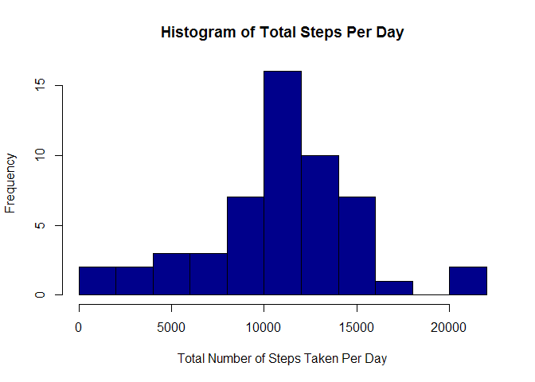
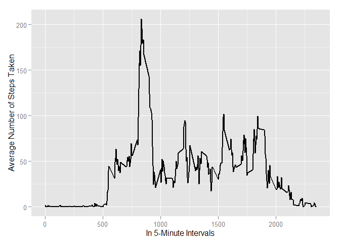
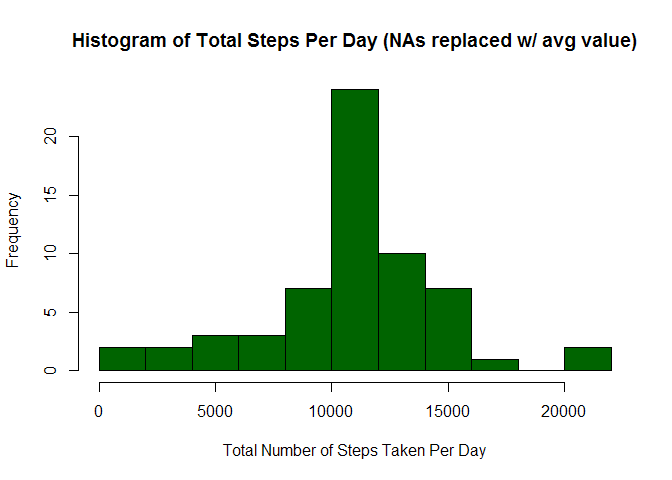
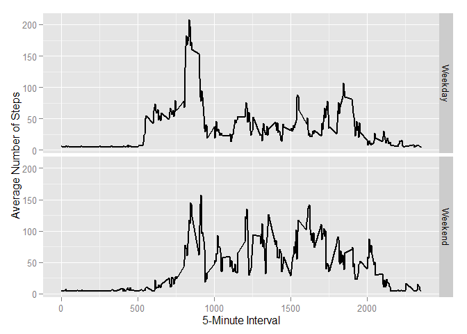

# Reproducible Research Project 1
Manny Joe  
Wednesday, March 11, 2015  

### Preliminary Steps  

Clear existing vectors


```r
# Clear any existing vectors
rm(list = ls())
```

Check required packages


```r
# Load needed libraries
library(ggplot2)
library(data.table)
library(plyr)
library(lattice)
```

### Loading and preprocessing the data

Show any code that is needed to  

1. Load the data (i.e. `read.csv()`)  


```r
# Unzip needed file
#unzip(zipfile = "repdata-data-activity.zip")
# Read the data in
data <- read.csv("./repdata-data-activity/activity.csv",
                 colClasses = c("integer", "Date", "factor"))
```

2. Process/transform the data (if necessary) into a format suitable for your analysis  


```r
# Convert date column to date class
data$month <- as.numeric(format(data$date, "%m"))

# Create a new dataframe without NA values
dataNoNA <- na.omit(data)
rownames(dataNoNA) <- 1:nrow(dataNoNA)

# check results
#head(dataNoNA)
#dim(dataNoNA)
#str(dataNoNA)
```

### What is mean total number of steps taken per day?  

For this part of the assignment, you can ignore the missing values in the dataset.  

1. Calculate the total number of steps taken per day  


```r
# Group date column values by date sum
stepsPerDay <- tapply(dataNoNA$steps, dataNoNA$date, FUN = sum)

# check results
#head(stepsPerDay)
#dim(stepsPerDay)
#str(stepsPerDay)
```

2. If you do not understand the difference between a histogram and a barplot, research the difference between them. Make a histogram of the total number of steps taken each day  


```r
# Create histogram of Total Steps per Day
hist(stepsPerDay, main = "Histogram of Total Steps Per Day", breaks = 10,
     col = "darkblue", 
     xlab = "Total Number of Steps Taken Per Day")
```

 

3. Calculate and report the mean and median of the total number of steps taken per day  


```r
# Calculate and report the mean of the total number steps per day
meanSPD <- mean(stepsPerDay)
meanSPD
```

```
## [1] 10766.19
```

```r
# Calculate and report the median of the number of steps per day
medianSPD <- median(stepsPerDay)
medianSPD
```

```
## [1] 10765
```

### What is the average daily activity pattern?  

1. Make a time series plot (i.e. `type = "l"`) of the 5-minute interval (x-axis) and the average number of steps taken, averaged across all days (y-axis)  


```r
# Create new data frame to show the mean of steps by five minute intervals
avgDAP <- aggregate(dataNoNA$steps, 
                    list(interval = as.numeric(as.character(dataNoNA$interval))), 
                    FUN = mean)
names(avgDAP)[2] <- "meanSteps"

# check results
#head(avgDAP)
#dim(avgDAP)
#str(avgDAP)

# Create line chart showing mean number of steps by five minute intervals
ggplot(data = avgDAP, aes(x = interval, y = meanSteps)) +
      geom_line(size = 0.75) +
      xlab("In 5-Minute Intervals") +
      ylab("Average Number of Steps Taken")
```

 

2. Which 5-minute interval, on average across all the days in the dataset, contains the maximum number of steps?  


```r
# Find the max value of the calculated mean steps in the daily activity pattern
avgDAP[avgDAP$meanSteps == max(avgDAP$meanSteps), ]
```

```
##     interval meanSteps
## 104      835  206.1698
```

### Imputing missing values  

Note that there are a number of days/intervals where there are missing values (coded as NA). The presence of missing days may introduce bias into some calculations or summaries of the data.  

1. Calculate and report the total number of missing values in the dataset (i.e. the total number of rows with NAs)  


```r
# Calculate the number of missing values (rows with NA values)
missingRows <- sum(is.na(data))
missingRows
```

```
## [1] 2304
```

2. Devise a strategy for filling in all of the missing values in the dataset. The strategy does not need to be sophisticated. For example, you could use the mean/median for that day, or the mean for that 5-minute interval, etc.  

I'll replace NA values with the mean of the 5-minute intervals.


```r
# Recall previously calculated average steps per day without NA values
meanSPD
```

```
## [1] 10766.19
```

```r
# Calculate and save average steps per 5-minute intervals
intervalMeanSPD<- meanSPD/288
intervalMeanSPD
```

```
## [1] 37.3826
```

3. Create a new dataset that is equal to the original dataset but with the missing data filled in.  


```r
# Replace NA values in the original data with calculated 5-minute interval
# averages

# Create new dataset
filledData <- data

# Replace NAs with 5-minute interval average

filledData[is.na(data$steps), ]$steps <- intervalMeanSPD

# check results
#sum(is.na(filledData))
#head(filledData)
#dim(filledData)
#str(filledData)
```

4. Make a histogram of the total number of steps taken each day and Calculate and report the mean and median total number of steps taken per day. Do these values differ from the estimates from the first part of the assignment? What is the impact of imputing missing data on the estimates of the total daily number of steps?  


```r
# Group new date column values by date sum
filledSPD <- tapply(filledData$steps, filledData$date, FUN = sum)

# Create a histogram of the total number of steps per day with the new filled in
# data

hist(filledSPD, 
     main = "Histogram of Total Steps Per Day (NAs replaced w/ avg value)",
     breaks = 10,
     col = "darkgreen", 
     xlab = "Total Number of Steps Taken Per Day")
```

 

```r
# Calculate new Mean and recall the original mean
newMeanSPD <- mean(filledSPD)
meanSPD
```

```
## [1] 10766.19
```

```r
newMeanSPD # Note that the new mean hasn't changed
```

```
## [1] 10766.19
```

```r
# Calculate new Median and recall the original median
newMedianSPD <- median(filledSPD)
medianSPD 
```

```
## [1] 10765
```

```r
newMeanSPD # Note that the new median is now the same as the new (and old) mean
```

```
## [1] 10766.19
```

### Are there differences in activity patterns between weekdays and weekends?  

For this part the `weekdays()` function may be of some help here. Use the dataset with the filled-in missing values for this part.  

1. Create a new factor variable in the dataset with two levels - "weekday" and "weekend" indicating whether a given date is a weekday or weekend day.  


```r
# add a new column containing day of week
filledData$weekday = weekdays(filledData$date)

# add a new column containing either Weekday OR Weekend
filledData$weekdayType <- ifelse(filledData$weekday
                                  == "Saturday" | filledData$weekday
                                  == "Sunday", "Weekend", "Weekday")

# convert column to factor
filledData$weekdayType <- factor(filledData$weekdayType)

# Check it out
#sum(is.na(filledData))
#head(filledData)
#dim(filledData)
#str(filledData)
```

2. Make a panel plot containing a time series plot (i.e. `type = "l"`) of the 5-minute interval (x-axis) and the average number of steps taken, averaged across all weekday days or weekend days (y-axis). See the README file in the GitHub repository to see an example of what this plot should look like using simulated data.  


```r
# make a new dataset grouping data by interval and weekdayType
intervalByType <- ddply(filledData, ~interval + weekdayType, summarize, 
    mean = mean(steps))

# Check it good
#sum(is.na(intervalByType))
#head(intervalByType)
#dim(intervalByType)

# For line plots unfactor the interval values
intervalByType$interval <- as.numeric(as.character(intervalByType$interval))

# Jim, he's really checked
#sum(is.na(intervalByType))
#head(intervalByType)
#dim(intervalByType)
#str(intervalByType)

# Create panel plot of the 5-minute interval (x-axis) and the average number of
# steps taken, seperating weekdays from weekends
ggplot(intervalByType, aes(interval, mean)) + 
      geom_line(size = 0.75) + 
      facet_grid(weekdayType ~ .) +
      xlab("5-Minute Interval") +
      ylab("Average Number of Steps")
```

 
